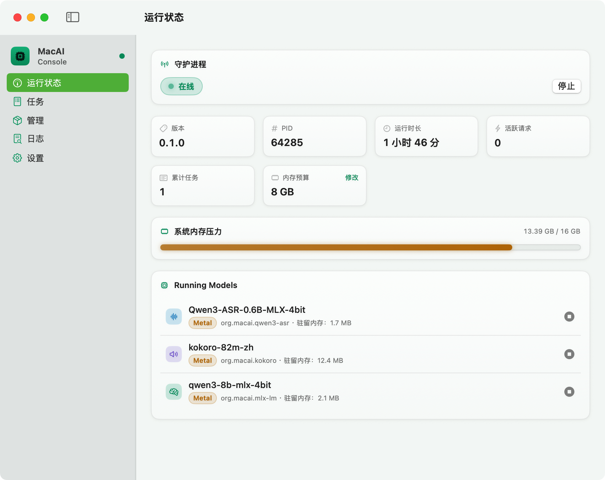
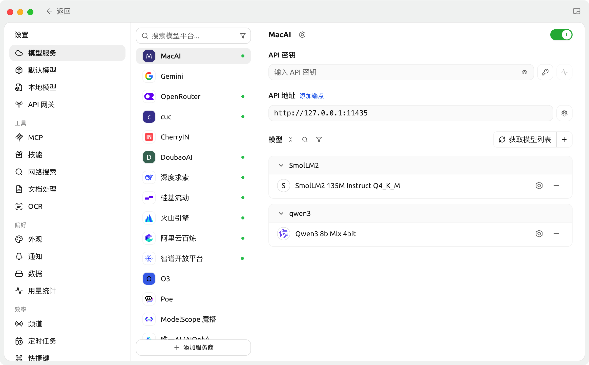

# MacAI

<p align="center">
  
</p>

MacAI 是面向 Apple Silicon 的开源本地 AI 运行管理系统，你可以导入任意包括大语言模型（LLM）、语音转文字模型（STT）、文字转语音模型（TTS）在内的等多种 AI 模型，在一个 Mac 原生应用中利用 Mac Silicon 的 CoreML 与 Metal 加速，并以 OpenAI 兼容方式提供所有的本地服务，将所有语音隐私数据在本地完成转写和生成。
> ⚠️项目处于开发阶段，适合本地开发、实验与个人工作流；目前无法承诺 API 稳定性和跨版本兼容。


## 系统要求

- Apple Silicon Mac
- macOS 14 或更高版本
- 源码构建额外需要：Rust stable toolchain、Xcode Command Line Tools、CMake、Python 3.12（若使用预打包 DMG，应用已自包含 `aiworkd` 与 `uv`，无需提前配置 Rust 或 Python 开发环境）

仓库源码与 DMG 均不包含模型权重文件，所有推理产物均在本地受管目录按需生成或存储。

## 快速开始


### 方式一：DMG 安装包快速使用（推荐普通用户）

1. **安装应用**：下载并打开 `MacAIConsole.dmg`，将 `MacAIConsole.app` 拖入 `Applications`（应用程序）文件夹。
2. **首次打开绕过安全拦截（Gatekeeper）**：
   - 现阶段版本采用本地 Ad-hoc 代码签名，尚未接入 Apple 付费开发者证书公证。从网络接收下载后打开若提示“已损坏，无法打开。你应该将它移到废纸篓”或“未知的开发者”，请在终端执行：
     ```bash
     xattr -cr /Applications/MacAIConsole.app
     ```
   - 或前往 macOS「系统设置 → 隐私与安全性」，滑至最下方“安全性”区域，点击「仍要打开」。
3. **首次配置与模型体验**：
   - 启动 `MacAIConsole`（应用内置自包含的 `aiworkd` 守护进程与 `uv` 环境工具）；
   - 在左侧进入**「管理」**页，顶端「引擎」区点击**「安装」**所需引擎（如 `llama.cpp` 或 `mlx-lm`；Python 依赖由内置 `uv` 自动隔离部署，无需系统预装 Python）；
   - 在推荐模型列表点击**「下载」**（如 Qwen3 8B）；若网络较慢，可先在**「设置」**页将下载源切换为 `https://hf-mirror.com` 或配置代理；
   - 模型下载完成后即可直接在控制台加载启动，或通过本地 OpenAI 兼容 API（默认 `http://127.0.0.1:11435/v1`）接入任意客户端。

> [!TIP]
> **whisper.cpp 引擎编译依赖提示**：`llama.cpp` 会自动下载验证过的预编译二进制，Python 系列引擎使用内置 `uv` 安装预构建 wheel。仅 `whisper.cpp` 引擎在点击安装时需下载官方源码归档并在本机通过 `cmake` 编译，需预先安装 Xcode Command Line Tools 和 `cmake`（如 `brew install cmake`）；普通用户建议优先体验预编译完善的 `llama.cpp`、`mlx-lm`、`qwen3-asr` 或 `kokoro`。


## 使用案例 1：为 Hermes Agent 提供本地 TTS 与 STT
使用本地配置和脚本接入 Hermes Desktop 应用，无需修改 Hermes Agent 代码，可实现自定义语音对话模型。
详情见链接：[案例](samples/Hermes_TTS_STT_sample.md)

## 使用案例 2：为 CherryStudio 接入本地 LLM

添加本地 API 地址： 
```
http：//127.0.0.1:11435
```

点击`获取模型列表`按钮会自动获取所有可提供的模型 ID


<details>
<summary><h2>
方式二：从源码构建运行（开发者）</h3></summary>

#### 1. 构建 workspace

```bash
cargo build --release --workspace
```

#### 2. 启动 daemon

```bash
./target/release/aiworkd
```

监听 `http://127.0.0.1:11435`。另开一个终端：

```bash
./target/release/macai status
./target/release/macai list
./target/release/macai ps
```

#### 3. 运行控制台 GUI（MacAIConsole）

MacAIConsole 是基于 SwiftUI 构建的 macOS 原生图形控制台。作为无状态客户端，它通过 HTTP API 与 `aiworkd` 通信，提供开箱即用的引擎运维、推荐模型下载、模型加载控制与系统监控能力。

**方式 A：一键联动构建并启动（推荐）**

在本地开发调试时，可使用打包脚本一键编译前后端、打包自包含 App 并直接拉起：

```bash
cd apps/MacAIConsole
scripts/build-app.sh release
```

该脚本会自动编译 Rust 后端（`aiworkd` 与 `macai`）和 SwiftUI 前端，并将 `uv` 工具与 `runners/` 目录组装至 `apps/MacAIConsole/build/MacAIConsole.app` 后自动拉起。之后如需单独启动已构建的应用：

```bash
open apps/MacAIConsole/build/MacAIConsole.app
```

**方式 B：快速以开发模式运行**

若已经在步骤 2 中启动了 `./target/release/aiworkd`，亦可在 `apps/MacAIConsole` 目录下直接通过 Swift 启动开发版 GUI：

```bash
cd apps/MacAIConsole
swift run
```

> [!TIP]
> GUI 默认连接 `http://127.0.0.1:11435`。如果启动 GUI 时 daemon 尚未运行，GUI 会自动按顺序探测本地构建产物（`AIWORKD_PATH` → `target/release/aiworkd` → `target/debug/aiworkd`）并自动拉起守护进程。

**通过 GUI 进行常用操作：**

- **引擎一键安装**：进入侧边栏**「管理」**页，页面顶端「引擎」区块分类展示了全部 7 个 Runner 引擎（`llama.cpp`、`whisper.cpp`、`mlx-lm`、`kokoro`、`qwen3-asr`、`qwen3-tts`、`sherpa-onnx`）的环境状态。点击对应引擎右侧的「安装」按钮，daemon 会自动下载验证过的预编译产物或通过隔离的 `uv` 环境配置依赖，无需手动在终端执行 `curl .../install` 或 `uv sync`。
- **推荐模型下载**：在「管理」页可浏览各引擎的精选推荐模型（如 Qwen3 8B、Kokoro-82M 等），点击「下载」即可由 daemon 在后台断点续传下载并存入本地受管目录（`~/Library/Application Support/MacAIConsole/Models/`）。如需使用国内镜像加速，可在**「设置」**页将下载源切换为 `https://hf-mirror.com`。
- **模型生命周期与参数设置**：下载完成后可直接在模型卡片上一键「启动」加载到内存或「卸载」；点击模型条目可进入详情页调整 `keep-alive` 空闲驻留时间、上下文长度或默认 TTS 音色。
- **状态与任务观测**：
  - **「运行状态」**：实时查看系统内存压力、MacAI 内存预算、已加载模型常驻内存（RSS）与 Metal/ANE 加速状态。
  - **「任务」**：实时查看会话请求流（Chat / STT / TTS）与每个请求的耗时与输入输出。
  - **「日志」**：实时查看 daemon 与 GUI 的日志输出，支持按级别过滤和着色。

#### 4. 安装 llama.cpp 引擎（Runner）

llama.cpp 已收敛至 Runner 架构（`org.macai.llama.cpp`）。引擎安装通过 daemon 统一入口执行——可经由 GUI「管理」页顶端「引擎」区块一键安装，或直接调用管理 API：

```bash
curl -X POST http://127.0.0.1:11435/api/runners/org.macai.llama.cpp/install
```

安装流程会自动同步 uv 受管的适配器环境，并下载验证过的 llama.cpp 预编译二进制（依赖 manifest `[engine]` 固定 tag 与 sha256 校验）到：
`~/Library/Application Support/MacAIConsole/Engines/org.macai.llama.cpp/`。

若本地已有兼容版本的可执行文件，可通过环境变量显式覆盖：

```bash
export MACAI_LLAMA_SERVER=/absolute/path/to/llama-server
```

注册并运行一个本地 GGUF：

```bash
./target/release/macai load /path/to/model.gguf \
  --id local-model \
  --type llm \
  --keep-alive 5m \
  --context-length 4096

./target/release/macai chat local-model "Hello" \
  --system "Answer concisely" \
  --temperature 0.2 \
  --max-tokens 256

./target/release/macai tasks --limit 10
./target/release/macai providers
./target/release/macai unload local-model
```

常用生命周期管理：
- 加载已注册模型：`./target/release/macai start <model>`
- 调整空闲驻留时间：`./target/release/macai keep-alive <model> 30m`
- 重命名模型 ID（运行中模型将先安全停用）：`./target/release/macai rename <old_id> <new_id>`
- 注销模型记录（保留文件）：`./target/release/macai remove <model>`
- TTS 音色查看与默认设置：`./target/release/macai voice <model>` 或 `./target/release/macai voice <model> <voice>`

#### 5. 安装 whisper.cpp 引擎（Runner）

```bash
curl -X POST http://127.0.0.1:11435/api/runners/org.macai.whisper.cpp/install
./scripts/download-whisper-model.sh base
```

安装流程会同步轻量适配器环境，校验 manifest 声明的 whisper.cpp 官方源码归档，并在临时暂存区构建静态链接的常驻 `whisper-server`，随后原子替换至：

```text
~/Library/Application Support/MacAIConsole/Engines/org.macai.whisper.cpp/build/bin/whisper-server
.build/models/ggml-base.bin
```

若本机已有对应版本的 server 二进制，可通过环境变量覆盖：

```bash
export MACAI_WHISPER_SERVER=/absolute/path/to/whisper-server
```

注册 `.bin` 格式 STT 模型时若省略 `--provider`，将默认路由至 `org.macai.whisper.cpp`；旧别名 `whisper.cpp` 会被自动规范化并持久化记录选择依据。常驻 server 在加载时初始化模型，后续转写请求均复用该内存实例。

Core ML encoder 为可选性能优化组件。将编译好的 `.mlmodelc` 目录置于与 `.bin` 模型同级的路径下并保持对应命名：

```text
ggml-large-v3-turbo.bin
ggml-large-v3-turbo-encoder.mlmodelc/
```

若未提供 encoder 目录，引擎将自动走 Metal 计算路径。

#### 6. 准备 Qwen3-ASR 0.6B

Qwen3-ASR 由 daemon 的 Qwen3-ASR Runner（`org.macai.qwen3-asr`）提供服务，Apple Silicon 上走 MLX/Metal 加速。Python 环境由 uv 受管：在 MacAIConsole「管理」页顶端对 `org.macai.qwen3-asr` 执行安装，或手动：

```bash
uv sync --project runners/qwen3-asr --locked --no-dev
```

推荐模型（4-bit，Hugging Face: `mlx-community/Qwen3-ASR-0.6B-4bit`）可以在 MacAIConsole「管理」页一键下载；模型目录放进 `~/Library/Application Support/MacAIConsole/Models/stt/`。

注册时显式选择 Runner provider `org.macai.qwen3-asr`，模型 ID 必须与目录名一致：

```bash
./target/release/macai load \
  "$HOME/Library/Application Support/MacAIConsole/Models/stt/Qwen3-ASR-0.6B-MLX-4bit" \
  --id Qwen3-ASR-0.6B-MLX-4bit \
  --type stt \
  --provider org.macai.qwen3-asr \
  --keep-alive always

./target/release/macai transcribe meeting.wav \
  --model Qwen3-ASR-0.6B-MLX-4bit \
  --language zh
```

#### 7. 准备 sherpa-onnx zh-int8-2025（Runner）

sherpa-onnx 由 daemon 的 sherpa-onnx Runner（`org.macai.sherpa-onnx`）提供服务，
Python 环境由 uv 受管：在 MacAIConsole「管理」页顶端对
`org.macai.sherpa-onnx` 执行安装，或手动：

```bash
uv sync --project runners/sherpa-onnx --locked --no-dev
```

sherpa-onnx 使用官方 streaming Zipformer 中文 int8 模型
`sherpa-onnx-streaming-zipformer-zh-int8-2025-06-30`。模型目录必须保留以下
四个文件；模型权重不提交到仓库：

```text
sherpa-onnx-streaming-zipformer-zh-int8-2025-06-30/
├── tokens.txt
├── encoder.int8.onnx
├── decoder.onnx
└── joiner.int8.onnx
```

模型下载（GitHub release 包或维护者 HF 镜像均可，布局一致）：

```bash
curl -L -o sherpa-onnx-model.tar.bz2 \
  https://github.com/k2-fsa/sherpa-onnx/releases/download/asr-models/sherpa-onnx-streaming-zipformer-zh-int8-2025-06-30.tar.bz2
tar xf sherpa-onnx-model.tar.bz2
rm sherpa-onnx-model.tar.bz2
```

注册时显式选择 Runner provider `org.macai.sherpa-onnx`，模型 ID 与目录名一致：

```bash
./target/release/macai load \
  ./sherpa-onnx-streaming-zipformer-zh-int8-2025-06-30 \
  --id sherpa-onnx-streaming-zipformer-zh-int8-2025-06-30 \
  --type stt \
  --provider org.macai.sherpa-onnx \
  --keep-alive always

./target/release/macai transcribe meeting.m4a \
  --model sherpa-onnx-streaming-zipformer-zh-int8-2025-06-30 \
  --language zh
```

上传入口会把 wav / mp3 / flac / ogg / m4a 统一解码为 PCM WAV；Runner 再将
多声道输入下混为单声道并按 streaming chunk 解码，因此长录音不会因一次性
把全部音频交给模型而改变内存行为。该模型只支持中文；`--language` 省略或
使用 `zh` / `zh-CN` / `Chinese` 均可。当前 Runner 固定 CPU 推理（Core ML
provider 需 runner 包内显式启用后另行声明）。

#### 8. 准备 Kokoro TTS

Kokoro 由 daemon 的 Kokoro Runner（`org.macai.kokoro`）提供服务，Python 环境由 uv 受管：在 MacAIConsole「管理」页顶端对 `org.macai.kokoro` 执行安装，或手动：

```bash
uv sync --project runners/kokoro --locked --no-dev
```

下载 [Kokoro-82M-zh-MLX](https://huggingface.co/1038lab/Kokoro-82M-zh-MLX)（推荐模型可在 MacAIConsole「管理」页一键下载），模型目录放进：

```text
~/Library/Application Support/MacAIConsole/Models/tts/
```

注册时显式选择 Runner provider `org.macai.kokoro`，模型 ID 与目录名一致：

```bash
./target/release/macai load \
  "$HOME/Library/Application Support/MacAIConsole/Models/tts/kokoro-82m-zh" \
  --id kokoro-82m-zh \
  --type tts \
  --provider org.macai.kokoro \
  --keep-alive always
```

#### 9. 准备 Qwen3-TTS CustomVoice（Runner）

Qwen3-TTS 由 daemon 的 Qwen3-TTS Runner（`org.macai.qwen3-tts`）提供服务，
Apple Silicon 上走 MLX/Metal 加速。Python 环境由 uv 受管：在 MacAIConsole
「管理」页顶端对 `org.macai.qwen3-tts` 执行安装，或手动：

```bash
uv sync --project runners/qwen3-tts --locked --no-dev
```

推荐模型（Qwen3-TTS 0.6B · CustomVoice 4-bit）可以在 MacAIConsole「管理」页一键下载；
或者手动下载 [mlx-community/Qwen3-TTS-12Hz-0.6B-CustomVoice-4bit](https://huggingface.co/mlx-community/Qwen3-TTS-12Hz-0.6B-CustomVoice-4bit)，
模型目录放进 `~/Library/Application Support/MacAIConsole/Models/tts/`。

注册时显式选择 Runner provider `org.macai.qwen3-tts`，模型 ID 与目录名一致：

```bash
./target/release/macai load \
  "$HOME/Library/Application Support/MacAIConsole/Models/tts/Qwen3-TTS-0.6B-CustomVoice-4bit" \
  --id Qwen3-TTS-0.6B-CustomVoice-4bit \
  --type tts \
  --provider org.macai.qwen3-tts \
  --keep-alive always

./target/release/macai speak Qwen3-TTS-0.6B-CustomVoice-4bit "你好，这是本地模型。"
```

请求只支持 WAV；`voice` 传递 Qwen3-TTS 的 speaker，
例如 `Vivian`。首版支持用逗号携带情感指令（`Vivian, very happy`）。
`speed` 参数仍按 `0.25..=4.0` 校验，但当前 `mlx-audio` 的
`generate_custom_voice` 没有 speed 参数，因此通过校验后不改变合成速度；后续
若上游提供原生支持再透传。详细设置中的默认音色提供 Qwen3-TTS 官方内置的
`Vivian`、`Serena`、`Uncle_Fu`、`Dylan`、`Eric`、`Ryan`、`Aiden`、
`Ono_Anna`、`Sohee`；首版不包含流式、声音克隆或 VoiceDesign。

#### 10. 准备 MLX-LM（Runner）

MLX LLM 由 daemon 的 mlx-lm Runner（`org.macai.mlx-lm`）提供服务，Apple Silicon 上走
MLX/Metal 加速。Python 环境由 uv 受管：在 MacAIConsole「管理」页顶端
对 `org.macai.mlx-lm` 执行安装，或手动：

```bash
uv sync --project runners/mlx-lm --locked --no-dev
```

推荐模型（SmolLM2-135M-Instruct-8bit、Qwen3 8B · MLX 4-bit）可以在 MacAIConsole
「管理」页一键下载；或者手动把 MLX 格式模型目录（含 `config.json` 与 safetensors 权重，
例如 [mlx-community/Qwen3-8B-4bit](https://huggingface.co/mlx-community/Qwen3-8B-4bit)）
放进：

```text
~/Library/Application Support/MacAIConsole/Models/llm/
```

注册时显式选择 Runner provider `org.macai.mlx-lm`，模型 ID 与目录名一致：

```bash
./target/release/macai load \
  "$HOME/Library/Application Support/MacAIConsole/Models/llm/SmolLM2-135M-Instruct-8bit" \
  --id SmolLM2-135M-Instruct-8bit \
  --type llm \
  --provider org.macai.mlx-lm \
  --keep-alive 5m
```

模型权重格式与 Runner 对应关系明确：GGUF 格式由 llama.cpp 加载，MLX 格式模型目录由 mlx-lm Runner 加载。

</details>

## 架构

```text
macai CLI ────────────┐
MacAIConsole (SwiftUI) ├── HTTP ──> aiworkd ──> Runners ─┬── whisper.cpp / llama.cpp（受管原生引擎）
OpenAI-compatible SDK ┘                                  └── MLX / Kokoro / Qwen3 / sherpa-onnx

                                             ├── SQLite model registry
                                             ├── memory budget / LRU / keep-alive
                                             ├── bounded task history
                                             └── local logs
```

CLI 与 SwiftUI 应用（MacAIConsole）均为无状态客户端。在 MacAI 中，客户端不维护常驻运行状态，所有界面数据均从 daemon 的 HTTP API 实时拉取。客户端退出或重载不会影响后台已驻留的推理实例。

## 详细介绍

### Runtime

- 默认监听 `127.0.0.1:11435`
- OpenAI-compatible Chat、STT 和 TTS endpoints
- Chat Completion 支持逐 token SSE streaming
- STT 音频上传支持 wav / mp3 / flac / ogg / m4a，由 daemon 在入口统一解码为 PCM WAV，下游 Provider 仅接收标准 PCM WAV 数据流（计划支持更多格式的输出）
- SQLite 模型注册表，重启后注册记录持久化保留
- 模型 load / unload、busy guard 和请求期 model lease：模型卸载操作绝不打断正在处理中的请求
- 内存预算默认 `min(RAM×0.75, RAM−8GB)`，支持 LRU 自动逐出、keep-alive 策略与空闲自动卸载
- 支持查看 worker RSS 驻留内存、硬件加速设备与活跃请求状态
- 维护 Chat / STT / TTS 的有界会话内任务历史
- 提供 GUI 与 daemon 的本地持久化日志

### Provider

| 能力 | Runner | 模型/输入 | 加速 |
| --- | --- | --- | --- |
| LLM | org.macai.llama.cpp | GGUF | Metal / Accelerate |
| LLM | org.macai.mlx-lm | MLX 模型目录（safetensors） | MLX / Metal |
| STT | org.macai.whisper.cpp | `.bin` + PCM WAV | Core ML 优先，Metal 回退 |
| STT | org.macai.sherpa-onnx | zh-int8-2025 model directory + PCM WAV | CPU |
| STT | org.macai.qwen3-asr | Qwen3-ASR MLX 模型目录 + PCM WAV | MLX / Metal GPU |
| TTS | org.macai.qwen3-tts | Qwen3-TTS CustomVoice 模型目录 | MLX / Metal GPU |
| TTS | org.macai.kokoro | Kokoro 模型目录 | MLX / Metal GPU |

Runner 架构中 daemon 自动发现 `runners/` 下的 Runner 包并装配为动态 Provider。Python 环境与原生 C++ 引擎共用同一套安装接口；`/api/model-profiles` 向客户端暴露数据化 catalog，按 Profile ID 下载时由 daemon 展开源地址、产物路径与 Runner 绑定。已注册模型会固化当时的 Profile 快照，不受后续 catalog 变更影响。

`/api/models/load` 将调用方请求的 Provider、daemon 选定的 Provider 与裁决理由一并持久化记录；
`/v1/models` 和 `/api/runtime` 暴露 `requested_provider`、`provider`、
`provider_selection_reason` 及 `effective_device`，便于审计选择逻辑与兼容别名。

本地目录通过 `POST /api/models/inspect` 由 daemon 信任的 Runner manifest 静态探测；只有
唯一匹配时才会颁发短期 routing token。CLI 可使用 `macai inspect <directory>` 查看检测结果，并通过
`macai load <directory> --routing-token <token>` 完成注册。GUI 采用相同诊断，不自行推断 Runner。

当前 Runner Protocol v1 针对单实例、单活动推理设计。信任特定 Runner 意味着允许其以
`aiworkd` 用户权限运行本地代码；digest 校验、环境变量白名单和输出路径检查不构成操作系统沙箱。

所有生产 Provider 均运行于独立 Runner 进程中，实现进程级故障隔离：当推理引擎发生段错误或 Python worker 发生 OOM 时，`aiworkd` 保持稳定存活并向客户端返回结构化的 `backend_crashed` 错误，其余模型服务不受影响。此外，系统坚持确定性调度：显式通过 `--provider` 指定引擎属于硬选择，若目标 Provider 不可用将直接失败并返回具体原因，不进行静默回退，确保推理延迟与硬件开销完全透明可溯。

### 客户端

CLI `macai` 当前提供：

```text
status      list        ps          providers   tasks
load        start       unload      remove      rename
keep-alive  pull        chat        run         transcribe
speak       voice       logging     serve
```

完整命令索引可通过 `macai --help` 查询，具体参数与示例参见 `macai <命令> --help`。关键语义说明：`start`、`unload`、`rename`、`keep-alive` 与 `remove` 统一操作 daemon 的运行时状态或 SQLite 注册表；`remove` 仅注销模型条目，磁盘上的模型源文件保持不变。由 Model Profile 绑定的模型 ID 具有固定命名约束，不支持 rename。

MacAIConsole 当前提供：

- Runtime 状态和系统内存压力
- 已加载模型、驻留内存和有效加速设备
- 「管理」页顶端置顶展示全部 7 个 Runner 引擎环境状态与一键安装控制（按 LLM、STT、TTS 顺序分类排列）
- 模型仓库、注册、加载、卸载、改名和详细设置
- 从 daemon Profile catalog 展示并一键下载推荐模型；引擎未就绪时行内提示引导参考顶部引擎区块，安装完成后可直接注册启动，无需修改或重启 GUI
- Chat / STT / TTS 任务记录与详情
- GUI / daemon 最近日志，支持 Info / Debug 过滤和级别着色
- 菜单栏状态与 daemon 启停
- 设置页支持切换 Hugging Face 官方源、`hf-mirror.com` 或自定义 Hugging Face 兼容源


## MacAIConsole

本地开发与打包：

```bash
cd apps/MacAIConsole

# 本地联调：停止旧进程、重新编译前后端并启动 app
scripts/build-app.sh release

# 打包自包含 DMG 安装镜像（产物为 build/MacAIConsole.dmg）
scripts/build-app.sh dmg
```

日常本地联调使用 `release` 动作即可；产物位于 `apps/MacAIConsole/build/MacAIConsole.app`（或 DMG 镜像 `build/MacAIConsole.dmg`）。

GUI 可以连接已经在跑的 `aiworkd`。GUI 自动启动 daemon 时按顺序探测：`AIWORKD_PATH` 环境变量 → 仓库 `target/release/aiworkd` → `target/debug/aiworkd`。

模型下载默认使用 `https://huggingface.co`。MacAIConsole 的「设置 → 模型下载源」可切换
到 `https://hf-mirror.com` 或填写自定义 HTTP(S) 地址；修改后点击「应用设置并重启
aiworkd」。下载由 daemon 统一执行，使用 HTTP/1.1、`.part` 断点续传，并在响应体中断
时自动重试。手动启动 daemon 时可设置：

```bash
AIWORKD_HF_ENDPOINT=https://hf-mirror.com ./target/release/aiworkd
```

自定义源只支持 HTTP(S) 主机和可选路径，不支持凭据、查询参数或片段。

## HTTP API

### Health

```bash
curl http://127.0.0.1:11435/health
```

### Chat Completion

```bash
curl http://127.0.0.1:11435/v1/chat/completions \
  -H 'Content-Type: application/json' \
  -d '{
    "model": "local-model",
    "messages": [{"role": "user", "content": "Hello"}],
    "stream": false
  }'
```

流式请求把 `stream` 设为 `true`，响应以 `data: [DONE]` 结束。

### OpenAI Python SDK

```python
from openai import OpenAI

client = OpenAI(
    base_url="http://127.0.0.1:11435/v1",
    api_key="local",
)

response = client.chat.completions.create(
    model="local-model",
    messages=[{"role": "user", "content": "Hello"}],
)
print(response.choices[0].message.content)
```

支持任何标准 OpenAI SDK，配置对应的 `base_url` 与模型 ID 即可接入。

### 主要 endpoints

```text
GET  /health
GET  /v1/models
POST /v1/chat/completions
POST /v1/audio/transcriptions
POST /v1/audio/speech

GET  /api/runtime
GET  /api/providers
GET  /api/runners
POST /api/runners/{runner}/install
GET  /api/tasks
GET  /api/tasks/{id}
GET  /api/logging
POST /api/logging
POST /api/models/pull
POST /api/models/inspect
POST /api/models/load
POST /api/models/{id}/load
POST /api/models/{id}/unload
DELETE /api/models/{id}
POST /api/models/{id}/rename
POST /api/models/{id}/keep-alive
GET  /api/models/{id}/voices
POST /api/models/{id}/voice
```

`/v1/*` 面向推理，`/api/*` 面向运行时管理。

## 本地数据

MacAIConsole 使用以下目录：

```text
~/Library/Application Support/MacAIConsole/
├── Models/
│   ├── llm/
│   ├── stt/
│   └── tts/
├── model-settings.json
├── models.db
└── logs/
    ├── aiworkd.log
    └── gui.log
```

日志到 5 MB 轮换，保留一份 `.1` 文件。日志页面默认显示 Info 及以上级别；启用 Debug 会同时调整 GUI 和 daemon 的运行时日志级别。

## 安全边界

`aiworkd` 默认仅监听本地回环地址（`127.0.0.1`），且未内置身份鉴权机制。如需通过端口转发、反向代理或局域网访问，务必在前端配置健全的安全隔离与身份认证。

任务历史可能包含 Prompt、转写结果与 TTS 文本输入。系统遵循数据最小化原则：原始音频数据不落盘写入任务历史，日志系统亦会主动过滤 API Token 与模型上下文内容。

## 开发与验证

Rust：

```bash
cargo fmt --all -- --check
cargo test --workspace
cargo build --workspace
```

MacAIConsole：

```bash
cd apps/MacAIConsole
DEVELOPER_DIR=/Applications/Xcode.app/Contents/Developer \
  swift test --enable-xctest
scripts/build-app.sh release
```

## 仓库结构

```text
crates/
├── ai-core/       # 共享模型、Provider、请求与响应类型
├── ai-daemon/     # aiworkd、Provider、调度与管理 API；Runner discovery/environment/instance bridge
└── ai-cli/        # macai 命令行客户端

apps/
└── MacAIConsole/  # 原生 SwiftUI 控制台

scripts/           # 模型下载、可选开发构建与真实 Runner smoke
runners/           # daemon 自动发现的七个 Runner 包（含 llama.cpp 与 whisper.cpp）
samples/           # 第三方集成示例（含 Hermes TTS/STT 适配器）
docs/              # 当前工作提案、已落地决策、精确契约与验证参考
```

## 架构基石与路线图

### 已落地核心架构

- [Runner 插件架构决策](docs/decisions/2026-09-02-runner-plugin-architecture.md)：所有生产模型接入收敛为可发现 Runner 与数据化 Model Profile。
- [uv Python 环境决策](docs/decisions/2026-09-02-uv-python-environments.md)：所有 Python Runner 使用可复现、可探测的受管 `uv` 环境。
- [whisper.cpp 与 llama.cpp 原生 Runner 迁移](docs/decisions/2026-09-05-whisper-runner-migration.md)：官方源码/二进制、常驻 server 与进程级隔离。
- [Kokoro Runner 验证参考](docs/reference/kokoro-runner-verification.md)：保留首个真实 Runner 的可重复证据路径。
- [管理页置顶 Runner 引擎状态与安装](docs/decisions/2026-09-07-management-view-engine-status-and-compact-recommendations.md)：一站式管理引擎环境与模型生命周期。

### 后续规划

- Runner 插件化，可自定义插拔
- Homebrew 分发、正式签名、公证与安装包
- VAD 与 streaming STT / TTS 进阶支持


## 社区与贡献

我们欢迎社区贡献！无论是新模型 Runner 插件、功能建议还是缺陷修复：
- 贡献指南请参见 [CONTRIBUTING.md](CONTRIBUTING.md)；
- 行为准则请参见 [CODE_OF_CONDUCT.md](CODE_OF_CONDUCT.md)。

## 安全政策

MacAI 专注于本机私有推理：`aiworkd` 默认仅监听本地 `127.0.0.1:11435` 且无鉴权机制，切勿直接公网暴露。完整威胁模型与漏洞报告指引请参见 [SECURITY.md](SECURITY.md)。

## 开源许可证与模型版权

- **项目许可证**：MacAI 依据 [MIT License](LICENSE) 开源；
- **第三方组件通知**：使用的第三方推理引擎与依赖库协议声明参见 [THIRD_PARTY_LICENSES.md](THIRD_PARTY_LICENSES.md)；
- **AI 模型免责声明**：MacAI 仅提供本地运行时与任务调度能力，不拥有亦不分发模型权重；下载与使用各开源模型需严格遵守其原始权利人的授权许可协议。

## 致谢与 AI 支持

感谢在本项目研发、设计与文档整理过程中提供支持的 AI 模型：

1. GPT 5.6
2. DeepSeek V4 flash
3. GLM 5.3 flash
4. Gemini 3.8 flash
